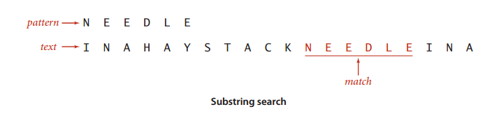

## Substring Search

A FUNDAMENTAL OPERATION on string is *substring search*: given a *text* string of length N and a *pattern* string of length M, find an occurrence of the pattern within the text. Most algorithms for this problem can easily be extended to find all occurrences of the pattern in the text, to count the number of occurrences of the pattern in the text, or to provide context (substrings of the text surrounding each occurrence of the pattern).

